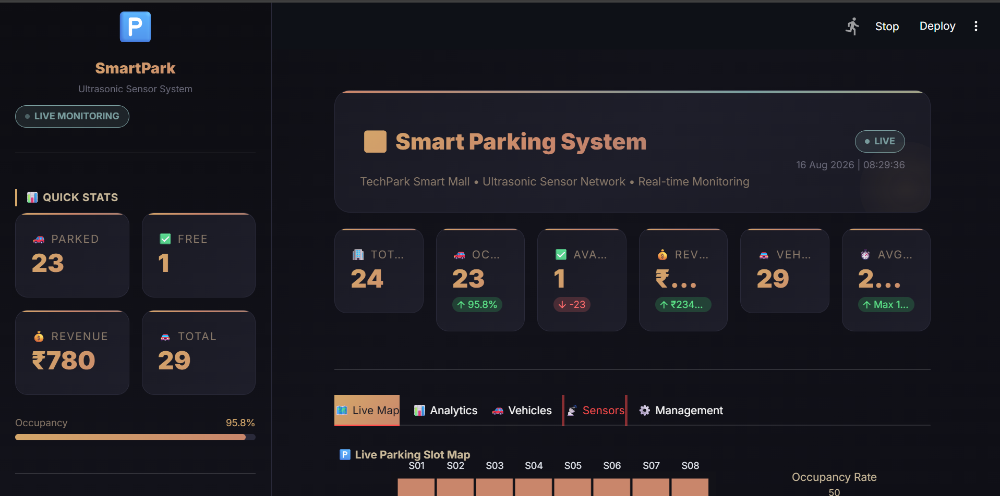
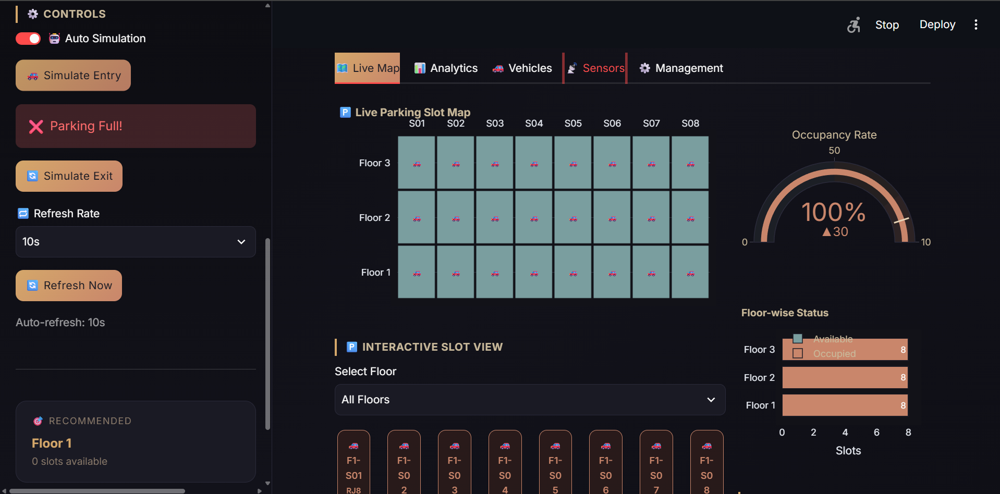
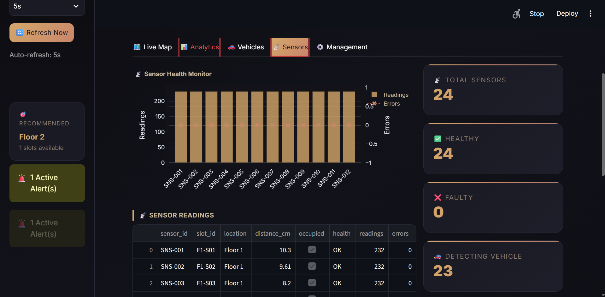

# 🗑️ Smart Dustbin — IoT Embedded Systems Simulator


---

## 🌐 Live Demo
**Simulator** → https://smart-dustbin-simulator.onrender.com

---

## 📌 Overview
A Smart Dustbin IoT system that automatically opens
its lid when a hand is detected, monitors waste levels
in real time, and triggers alerts when the bin is full.
Built with Arduino Embedded C + Web Simulator Dashboard.

---

## 📸 Screenshots

### 🖥 Simulator Dashboard



---

## 🎯 Problem Statement
Manual waste monitoring is inefficient and unhygienic.
This Smart Dustbin automates:
- Touchless lid opening
- Real-time waste level monitoring
- Automatic full-bin alerts
- Remote monitoring via IoT dashboard

---

## 🏢 Industry Use Cases
| Location | Use Case |
|----------|---------|
| 🏥 Hospitals | Touchless hygienic disposal |
| ✈️ Airports | Smart waste monitoring |
| 🏫 Schools | Automated collection alerts |
| 🏙️ Smart Cities | IoT waste management |
| 🏭 Industries | Automated waste tracking |
| 🛒 Malls | Overflow prevention |

---

## 🛠️ Tech Stack

### Hardware (Real Implementation)
| Component | Purpose |
|-----------|---------|
| Arduino UNO | Microcontroller |
| HC-SR04 #1 | Hand/Object Detection |
| HC-SR04 #2 | Waste Level Detection |
| Servo Motor | Automatic Lid Control |
| Green LED | Bin OK Indicator |
| Red LED | Bin Full Indicator |
| Buzzer | Full Bin Alert |

### Software (Simulator)
| Tool | Purpose |
|------|---------|
| Arduino C | Embedded firmware |
| HTML/CSS/JS | Web simulator |
| Node.js + Express | Server |
| Render | Cloud deployment |

---

## 📁 Folder Structure
```
Smart-Dustbin/
│
├── arduino/
│ └── smart_dustbin.ino # Arduino firmware
│
├── simulator/
│ ├── index.html # Dashboard UI
│ ├── style.css # Cyberpunk styling
│ └── app.js # Simulation logic
│
├── images/ # Screenshots
├── server.js # Express server
├── package.json
└── README.md
```
---

## ⚙️ How to Run Locally

```bash
# 1. Clone the repo
git clone https://github.com/Neha-Joshi05/Smart-Dustbin.git
cd Smart-Dustbin

# 2. Install dependencies
npm install

# 3. Start server
node server.js

# 4. Open browser
# Go to → http://localhost:3000
```

---

## 🔌 Circuit Connections

| Arduino Pin | Component | Wire |
|-------------|-----------|------|
| D2 | HC-SR04 #1 TRIG | Yellow |
| D3 | HC-SR04 #1 ECHO | Green |
| D4 | HC-SR04 #2 TRIG | Yellow |
| D5 | HC-SR04 #2 ECHO | Green |
| D6 | Buzzer + | Red |
| D7 | Green LED + | Green |
| D8 | Red LED + | Red |
| D9 | Servo Signal | Orange |
| 5V | VCC (all) | Red |
| GND | GND (all) | Black |

---

## 🧠 Embedded System Concepts

| Concept | Implementation |
|---------|---------------|
| GPIO | Sensor + LED + Buzzer pins |
| PWM | Servo motor control |
| Ultrasonic | Distance measurement |
| Threshold Logic | Fill % calculation |
| Timer/Delay | Auto lid close |
| Serial Comm | Debug monitoring |

---

## 🎯 Simulator Features
- 👋 Hand detection slider
- 📊 Waste level control
- 🔄 Automatic lid animation
- 💡 LED indicators
- 🔔 Buzzer animation
- 📟 Serial monitor
- 📈 Session statistics
- 🚨 Full bin alerts


## 👤 Author
**Neha Joshi**
- GitHub: [@Neha-Joshi05](https://github.com/Neha-Joshi05/Smart-Dustbin.git)
- LinkedIn: https://www.linkedin.com/in/neha-joshi-0851a2322?utm_source=share_via&utm_content=profile&utm_medium=member_android
---

## ⭐ Star this repo if you found it helpful!